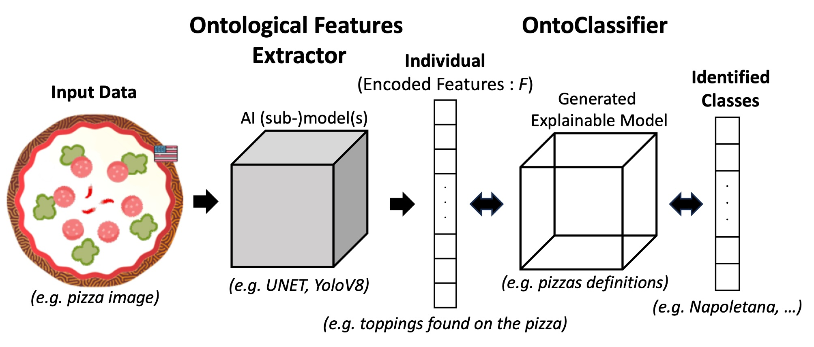

# ontoclassifier

## What is it ?

Ontoclassifier is a module implementing a Concept-Based approach. From concepts detected by third-party ML models, the ontoclassifier can infer classes (predictions) corresponding to Description Logic rules. 

The ontoclassifier can be directly plugged into a pytorch AI pipeline. 

For example, if a ML model can detect ingredients on a pizza, the ontoclassifier can infer the pizza receipe and characteristics. Furthermore, this classification is fully transparent and explainable since it is based on logical rules. 

## How to use it ?

See examples in 3 notebooks:

- [Pizzaiolo classification notebook](examples/Pizzaiolo_pipeline.ipynb)
- [XTRAINS classification notebook](examples/XTRAINS_pipeline.ipynb)
- [SCDB notebook](examples/SCDB_pipeline.ipynb)

## Authors

Grégory Bourguin1 & Arnaud Lewandowski2  
SysReIC (Systèmes Réflexifs et Ingenierie de la Connaissance)  
[LISIC](https://lisic-prod.univ-littoral.fr/) (Laboratoire Informatique Signal et Image de la Côte d'opale)  
[ULCO](https://www.univ-littoral.fr/) (Université du Littoral Côte d'Opale), FRANCE

1 gregory.bourguin@univ-littoral.fr  
2 arnaud.lewandowski@univ-littoral.fr

 &nbsp;&nbsp;&nbsp;&nbsp; 

